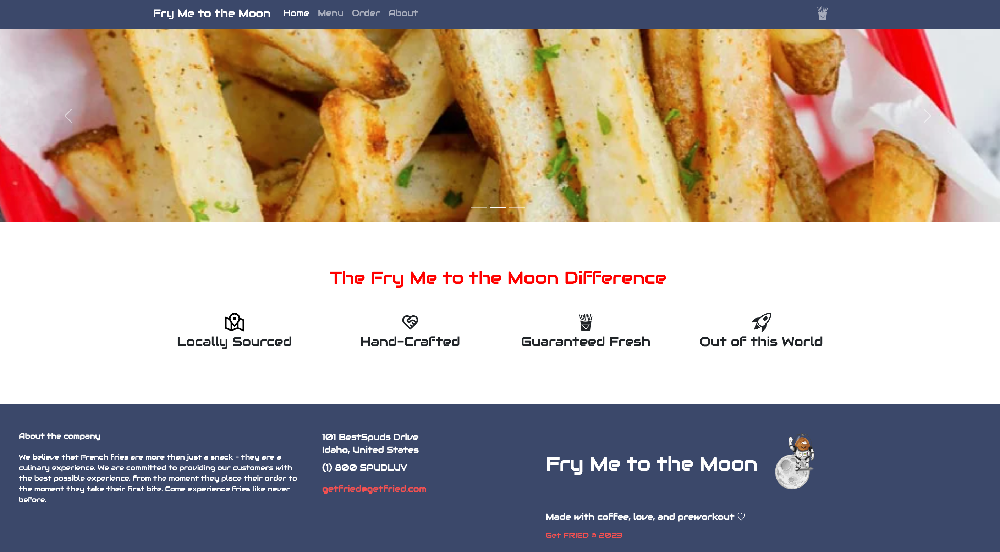

# Fry Me to the Moon 



## About the Project
Collaborators: Vanessa Coelho, Sam Genevay, Grace Nieboer
The application delivers a user-friendly outer-space themed ordering experience for artisan fry lovers everywhere.

## Built With
- React
- Flask
- Bootstrap
- Material UI
- SQLAlchemy
- Formik

## Getting Started
1. Fork and Clone the repo
   ```sh
   git clone https://github.com/patchwork109/phase-4-project
   ```
2. Install your environment dependencies and enter virtual environment:
    ```sh
    pipenv install
    ```
    ```sh
    pipenv shell
    ```
3. From the client directory, install client dependencies
    ```sh
    npm install
    ```

4. From the client directory, start the front end
```sh
 npm start
 ```
5. From the server directory, start the back end
```sh
python app.py
```

## How to Use this Application 


Our users will be able to browse all potato creations. They can login in and become a spud member for life. Our users must log in or sign up in order to place a fry order. They can also edit or cancel any orders they have started. Once our users place an order they will be notified that their order is being prepared.


## Special Features

**client side features:**
- User Authentication
- Cart Icon
- Home page carousel
- Hovering menu descriptions
- Full featured cart
- Dynamic ordering page

**Server side features:**
- Three Dynamic domain models
- RESTful API architecture
    - (Login, '/login')
    - (Logout, '/logout')
    - (Users, '/users')
    - (PotatoDishes, '/potatodishes')
    - (Orders, '/orders')
    - (OrderById, '/orders/<int:id>')
    - (DishOrders, '/dishorders')
    - (DishOrderById, '/dishorders/<int:id>')
- The ability to GET, POST, PATCH, DELETE

**Made with love, coffee, and preworkout <3**
